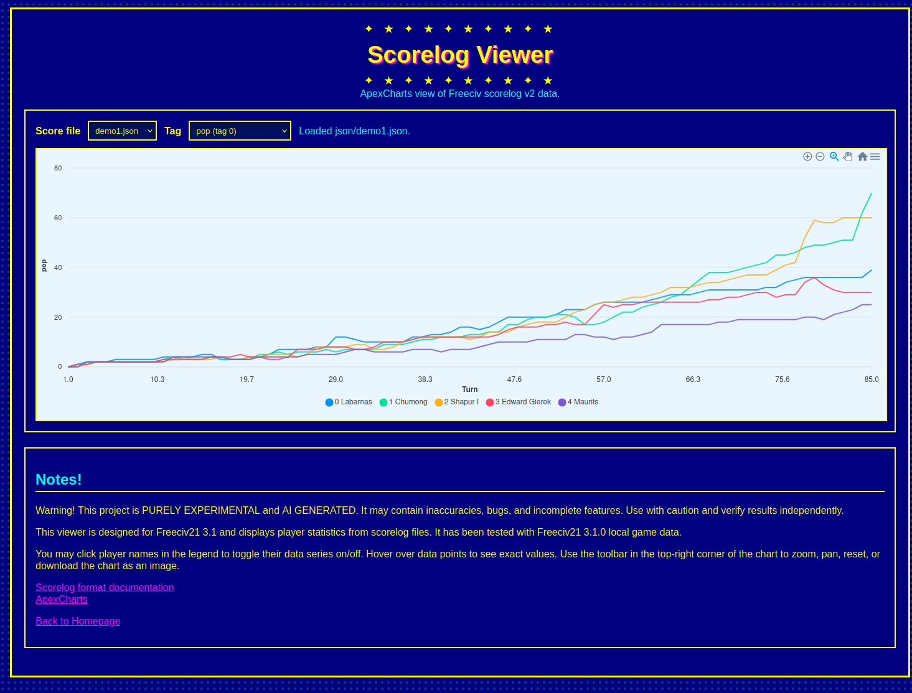

# scorelog_viewer
ApexCharts view of Freeciv scorelog 

This viewer is designed for Freeciv21 3.1 and displays player statistics from scorelog files. It has been tested with Freeciv21 3.1.0 local game data.




```

$ ./convert-scorelog.py -h
usage: convert-scorelog.py [-h] [-o OUTPUT] input

positional arguments:
  input                Path to scorelog file

options:
  -h, --help           show this help message and exit
  -o, --output OUTPUT

```

Copy converted logs files under web/json folder and from app.js

```
const DEFAULT_SCORELOG_FILES = [
  "json/demo1.json",
  "json/demo2.json"
];
```

Modify json files right and just throw it some webserver. Just Static web pages. 

Under web folder, you can easily launch your own local web server 

```
$  python3 -m http.server
Serving HTTP on 0.0.0.0 port 8000 (http://0.0.0.0:8000/) ...
```

Warning! This project is PURELY EXPERIMENTAL and AI GENERATED. It may contain inaccuracies, bugs, and incomplete features. Use with caution and verify results independently.
